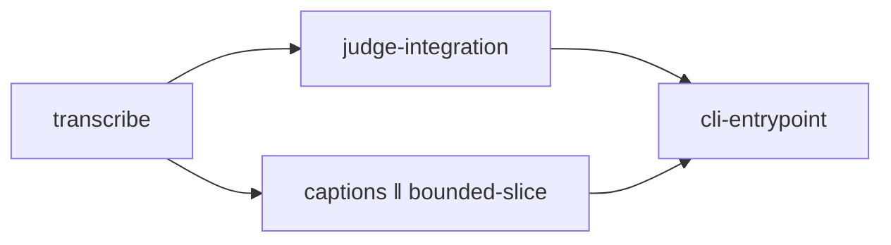

# Design Discussion — transcribe-caption-cli

> **Process note:** this epic was planned by a single orchestrator pass (no researcher/technical-writer/tpm
> teammate fan-out, no grill loop, no KG/dag-executor calls) — video-utils has no `hive/lib` runtime
> vendored into the repo, and the roster of planning personas isn't wired up in this environment. This
> document covers the same ground `/plan`'s Phase A/B would (goal, approach, layers/slices, risks, open
> questions, scale) directly, without the multi-agent ceremony. See `research-brief.md` for the codebase
> grounding.

## 0. Context

**North star** (from `.pHive/project-profile.yaml`):
- Goal: go from "stop recording" to "published short" with minimal manual effort
- Audience: solo build-in-public creators
- Scale: single local user
- Pain: manual/slow pipeline stages + no CLI polish; operator has limited editing experience and wants
  the tool to help guide/cut/crop/rate while they learn, working toward Opus-Clip-style full automation

No prior KG decisions exist for this project (first epic).

## 1. Goal

Close three near-term ROADMAP.md gaps that directly serve the north star's "faster stop-to-post"
success metric:

1. **Transcription** — a local Whisper pass over the audio already extracted by `ingest.sh`.
2. **Auto-captions** — turn that transcript into `.srt` and (optionally) burn styled captions into
   the cut clips.
3. **A real CLI** — one `video` entrypoint (`video pull|ingest|review|transcribe|caption|clip`)
   instead of five separate scripts, with `--help`.

Explicitly out of scope for this epic (stay on the ROADMAP backlog): vertical/short reframe,
thumbnail generator, config file (`video.toml`), Flayr/Opus integrations, batch mode, dashboard.

## 2. Proposed approach

Four vertical slices, each leaving the pipeline in a genuinely working state:

*(`judge-integration` and `captions` touch disjoint files — `bin/review.py` vs. a new `bin/caption.sh`
— so they're candidates to implement in either order or in parallel; `cli-entrypoint` needs both
finished so it wraps the final subcommand surface once, not twice.)*

**Slice 1 — Transcription (`bin/transcribe.sh`)**
New tool, mirrors `ingest.sh`'s shape: `transcribe.sh <slug>` runs a local Whisper (or whisper.cpp)
pass over `work/<slug>/audio.wav` → `work/<slug>/transcript.vtt` + `work/<slug>/transcript.txt`.
Env: `VIDEO_WHISPER_BIN` (path to the whisper/whisper.cpp binary, optional if `whisper` is on
`$PATH`), `VIDEO_WHISPER_MODEL` (default `base`). Non-fatal if the binary is missing (same pattern
as `ingest.sh`'s ffprobe/ffmpeg guards) — print a "not found, skipping" message and exit 0 so it's
safe to always run in a wrapped pipeline.

**Slice 2 — Judge integration (`bin/review.py` change)**
`review.py` reads `work/<slug>/transcript.txt` if present and appends it as a second `text` part in
the Gemini request (or interpolates into the prompt) so the judge picks better clip moments — this
is explicitly called out in ROADMAP.md ("feed the transcript to the judge for better clip picks").
Falls back to today's video-only behavior when no transcript exists — ordering (`transcribe.sh` then
`review.py`) is a recommendation, not a hard requirement.

**Slice 3 — Captions (`bin/caption.sh`)**
New tool, separate from `clip.sh` (Unix-philosophy: captioning isn't clip-cutting). `caption.sh
<slug>` converts `work/<slug>/transcript.vtt` → `work/<slug>/transcript.srt` (cheap, always done).
Burning captions into the already-cut files under `clips/<slug>/*.mp4` is opt-in via
`VIDEO_CAPTION_BURN=1` (or a `--burn` flag) since it's a destructive re-encode — writes
`clips/<slug>/<name>.captioned.mp4` alongside the original rather than overwriting it. Env:
`VIDEO_CAPTION_BURN` (default off), `VIDEO_CAPTION_STYLE` (optional ffmpeg subtitles `force_style`
string).

**Slice 4 — CLI entrypoint (`bin/video`)**
One dispatcher wrapping all six stages (`pull|ingest|review|transcribe|caption|clip`) plus `--help`.
Thin wrapper only — delegates to the existing scripts by `exec`'ing them, does not reimplement their
logic. This is deliberately sequenced last so it wraps the final six-subcommand surface once.

## 3. Cross-cutting concerns (evaluated per story in the story YAMLs)
`documentation`, `env-config-only`, `no-secrets-no-media-in-git`, `honest-status` — all four apply to
at least one story; see each story's `cross_cutting:` block.

## 4. Risks

| Severity | Risk | Mitigation |
|---|---|---|
| medium | Whisper/whisper.cpp isn't installed on every dev machine (no package manager assumption in AGENTS.md beyond bash/python3/curl/ffmpeg/gcloud) | Non-fatal guard (same pattern as `ingest.sh`'s ffprobe/ffmpeg checks) — print install hint, exit 0 |
| low | Burned-in captions are a lossy re-encode of an already-lossy clip | Opt-in only (`VIDEO_CAPTION_BURN`), writes a sibling `.captioned.mp4` rather than overwriting |
| low | `bin/video` dispatcher drifts out of sync with the underlying scripts' flags/usage strings | Keep it a pure `exec`-based wrapper with no flag re-parsing beyond subcommand routing |
| low | Gemini prompt token budget grows once transcripts are appended for long recordings | Out of scope for this epic — flag as a follow-up if it becomes a real problem |

## 5. Open questions

1. Whisper vs. whisper.cpp as the assumed binary — should `transcribe.sh` special-case both, or pick
   one and document the other as "bring your own binary via `VIDEO_WHISPER_BIN`"? *(Recommendation:
   the latter — matches the existing "depend only on common tools" + "config via env" principles;
   don't vendor a specific install method.)*
2. Should `video` (slice 4) become the *documented* primary interface (README quick start rewritten
   to use it), or stay a convenience wrapper alongside the existing standalone scripts? *(Both keep
   working either way — this only affects docs.)*

## 6. Scale assessment

**SCALE DECISION: Medium**

Multi-file (two new scripts, one modified script, one new dispatcher, README/ARCHITECTURE/ROADMAP/
`.env.example` doc updates), multiple pipeline stages touched, but single system (no cross-stack
split, no migration, no new external service). Recommend skipping the full H/V-document ceremony
(no separate `horizontal-plan.md`/`vertical-plan.md`) since slices are already fully specified above
and this is a solo-orchestrator run — proceeding straight to story decomposition once you confirm.

No LSP suggestion applies (bash/python have no confirmed Hive LSP plugin mapping).
